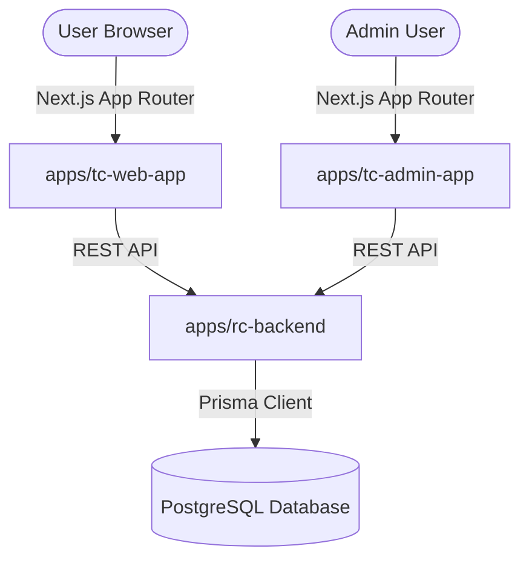

# 🍛 Tandoori Corner Monorepo

Welcome to the **Tandoori Corner** monorepo—the unified digital platform for Tandoori Corner Singapore. This project manages the client web experience, administrative dashboard, and Fastify-based backend microservices.

---

## 🏗️ Repository Architecture

This project is configured as a **`pnpm` workspace** monorepo:



### 📦 Workspace Projects

| Project / Directory | Framework / Core Tech | Port | Description |
| :--- | :--- | :--- | :--- |
| [apps/tc-web-app](file:///Users/mahendra/mywork/prajanova/tandoori-corner/apps/tc-web-app) | **Next.js 16 (React 19)**, TypeScript, Tailwind CSS v4, Motion | `3000` | User-facing website hosting active routes such as `/menu`, `/order`, `/catering`, `/private-events`, `/story`, and `/checkout`. |
| [apps/rc-backend](file:///Users/mahendra/mywork/prajanova/tandoori-corner/apps/rc-backend) | **Fastify**, TypeScript, Prisma ORM, PostgreSQL | `3002` (configurable) | Backend microservice API handling menu catalog, catering packages, order pipelines, and database adapters. |
| [apps/tc-admin-app](file:///Users/mahendra/mywork/prajanova/tandoori-corner/apps/tc-admin-app) | **Next.js 16 (React 19)**, TypeScript, Tailwind CSS v4 | `3001` | Management dashboard for handling orders, catalog items, and restaurant operations. |
| [skills/](file:///Users/mahendra/mywork/prajanova/tandoori-corner/skills) | Monorepo Guidelines | - | Codebase specifications, React composition patterns, design rules, and Shadcn standards. |

---

## 🚀 Getting Started

### 1. Prerequisites
Ensure you have the following installed locally:
- **Node.js** (v20 or newer)
- **pnpm** (Package manager, version 8 or newer)
- **PostgreSQL** (A running database instance for local data storage)

### 2. Workspace Setup
From the workspace root, run the following to install all project dependencies:
```bash
pnpm install
```

### 3. Environment Configuration
Create local configuration files from the templates provided:
- **Web Client**: Copy [apps/tc-web-app/.env.example](file:///Users/mahendra/mywork/prajanova/tandoori-corner/apps/tc-web-app/.env.example) to `.env.local`
- **Admin Client**: Copy [apps/tc-admin-app/.env.example](file:///Users/mahendra/mywork/prajanova/tandoori-corner/apps/tc-admin-app/.env.example) to `.env.local`
- **Backend API**: Copy [apps/rc-backend/.env.example](file:///Users/mahendra/mywork/prajanova/tandoori-corner/apps/rc-backend/.env.example) to `.env` and fill out the database credentials in `DATABASE_URL`.

### 4. Database Setup & Seeding
Prepare the PostgreSQL database schemas and seed initial data:
```bash
# Apply migrations to your Postgres instance
pnpm --filter rc-backend prisma:migrate

# Seed initial restaurant catalogs, categories, menu items, and catering packages
pnpm --filter rc-backend prisma:seed
```

---

## 💻 Commands Reference

The workspace root provides centralized commands to manage all sub-packages:

| Command | Description | Package Scope |
| :--- | :--- | :--- |
| `pnpm dev` or `pnpm dev:web` | Starts the client-facing Next.js application dev server. | `apps/tc-web-app` |
| `pnpm dev:backend` | Starts the Fastify backend watch service. | `apps/rc-backend` |
| `pnpm --filter tc-admin-app dev` | Starts the administrative dashboard dev server. | `apps/tc-admin-app` |
| `pnpm build` | Compiles and builds all workspace packages. | All packages |
| `pnpm build:web` | Compiles the public web application for production. | `apps/tc-web-app` |
| `pnpm build:backend` | Runs Prisma schema generation and compiles TypeScript backend files. | `apps/rc-backend` |
| `pnpm lint` | Runs workspace-wide linting and code quality audits. | All files (via Biome) |
| `pnpm format` | Auto-formats code styles, spacing, and import organization. | All files (via Biome) |

---

## 🎨 Design & Coding Guidelines

To preserve design alignment and performance metrics across updates, follow these practices:

### 📐 Component Architecture
- **Avoid Router Bloat**: Active routes are structured under [apps/tc-web-app/app/](file:///Users/mahendra/mywork/prajanova/tandoori-corner/apps/tc-web-app/app/).
- **Page Modularity**: Individual route pages should not contain monolithic UI markups. Place all route-specific sections (e.g. `Hero`, `Highlights`, `Features`, `Form`) inside route subfolders in [apps/tc-web-app/components/](file:///Users/mahendra/mywork/prajanova/tandoori-corner/apps/tc-web-app/components/) (e.g. `components/catering/` or `components/story/`).
- **Shared Primitives**: Place reusable elements, buttons, and Shadcn-inspired UI components under [apps/tc-web-app/components/ui/](file:///Users/mahendra/mywork/prajanova/tandoori-corner/apps/tc-web-app/components/ui/).

### 🍛 Brand & Theme Tokens
Consult the live [Tandoori Corner Singapore](https://www.tandooricorner.com.sg/) site for copy, details, and color treatments.
- **Typography**: 
  - Body/UI: `Raleway`
  - Display headings: `Kaushan Script`
  - Script accents: `Great Vibes`
- **Tailwind v4 Theme Tokens**:
  - `tandoori`, `tandoori-dark` (rich branding red accents)
  - `cream` (soft background canvas)
  - `ink` (deep text color and header blocks)
  - `sage` (earthy accents)
- Prefer theme-level tokens (`bg-primary`, `bg-card`, `text-muted-foreground`, `border-border`, `bg-brand-dark`, `text-brand-gold`, `text-leaf`) rather than hardcoding static CSS HEX values.

### ⚡ React & Next.js Rules
- **Server Components**: Write Server Components by default to maximize SSR performance. Use `"use client"` strictly for interactive parts requiring React state (`useState`, `useEffect`) or DOM event handlers.
- **Next.js Images**: Supply both `width` and `height` properties. Since Tailwind v4 overrides image heights globally, include `style={{ height: 'auto' }}` on custom vectors or specific icons to prevent aspect-ratio layout shift warnings.
- **Actions**: Make sure buttons like call-to-actions, phone numbers, and WhatsApp links have full functionality and use primary brand colors.

---

## 🛠️ Tooling & Validation

[Biome](file:///Users/mahendra/mywork/prajanova/tandoori-corner/biome.json) handles lints, static checks, format rules, and import organization.

Validate your edits before proposing commits:
```bash
# Organize imports & check for formatting or lint errors
pnpm lint

# Ensure compilation compiles successfully across the monorepo
pnpm build
```
