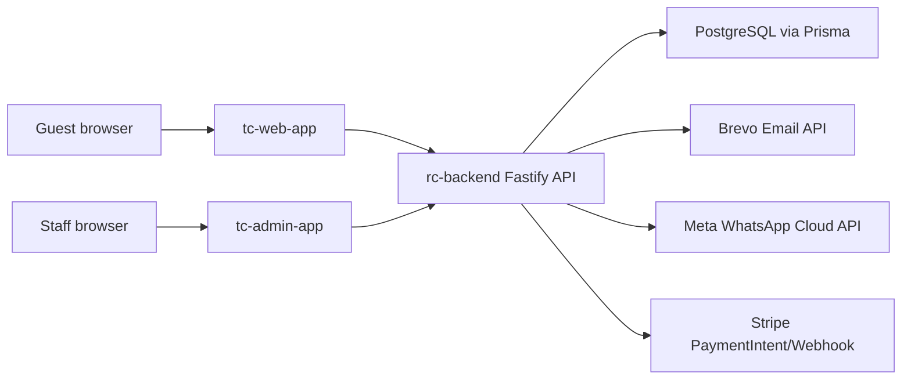

# Technical Architecture

## System Layout

- `apps/tc-web-app`: customer-facing Next.js 16 App Router app.
- `apps/tc-admin-app`: staff-facing Next.js 16 App Router app.
- `apps/rc-backend`: Fastify API service with Prisma and PostgreSQL.
- `docs/`: feature and operating documentation.
- `tests/e2e`: Playwright smoke tests.

## Runtime Ports

- Customer web: `http://localhost:3000`
- Admin web: `http://localhost:3001`
- Backend API: `http://localhost:4000` locally when `PORT=4000`

## Data Flow



## Backend

`apps/rc-backend/src/app.ts` builds the Fastify app and registers:

- `/api/catalog`
- `/api/menu`
- `/api/catering`
- `/api/bookings`
- `/api/event-enquiries`
- `/api/orders`
- health routes

Services sit under `apps/rc-backend/src/services/`. Route modules own HTTP validation, auth guards, rate limits, notifications, and audit calls. Prisma models live in `apps/rc-backend/prisma/schema.prisma`.

## Data Model

Core persisted entities:

- `CatalogCategory`, `CatalogItem`
- `CateringPackage`
- `MenuCategory`, `MenuItem`
- `Booking`
- `EventEnquiry`
- `Order`, `OrderItem`
- `AuditLog`

Order and payment values are stored in cents. Order item names and prices are snapshotted at checkout.

## Frontend

The customer app uses App Router pages under `apps/tc-web-app/app/` and reusable components under `apps/tc-web-app/components/`.

The admin app uses server-rendered pages under `apps/tc-admin-app/app/`; `apps/tc-admin-app/lib/api.ts` calls the backend server-side and attaches the admin bearer token.

## Integrations

- Stripe: `apps/rc-backend/src/services/payment-service.ts`
- Email/WhatsApp: `apps/rc-backend/src/services/notification-service.ts`
- SEO helpers: `apps/tc-web-app/lib/seo.ts`

## Local Startup

```sh
pnpm --filter rc-backend prisma:deploy
pnpm --filter rc-backend prisma:seed
PORT=4000 ADMIN_API_TOKEN=local-admin-token pnpm --filter rc-backend dev
pnpm --filter tc-web-app dev
ADMIN_API_TOKEN=local-admin-token pnpm --filter tc-admin-app dev
```
